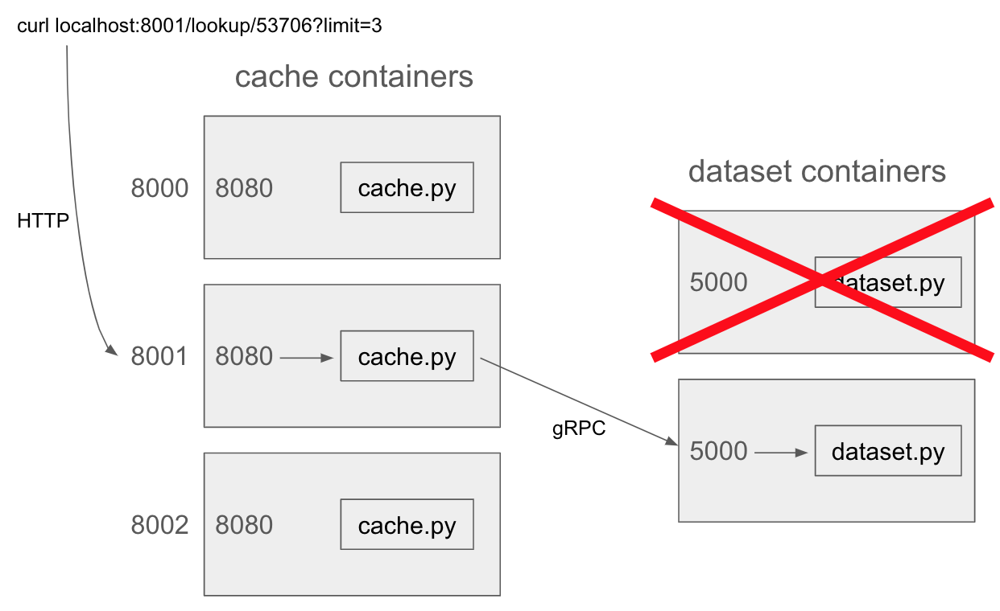

# DRAFT! Don't start yet

# P2 (3% of grade): gRPC and Containers

## Overview

In this project, you'll work with a multi-container application for
looking up property addresses in Madison.  You'll have multiple
containers serving the dataset, so that if one fails, the system will
remain available.  You'll also have multiple caching containers that
will serve REST requests and minimize load on the dataset.

In this project, there is already a legacy dataset backend, written in
Java.  You are not expected to know Java.  With the help of AI, you
will port this code to Python.

Learning objectives:
* tolerate failures with retries
* implement an LRU cache
* port code between languages (Java → Python)
* prompt Aider to generate code on your behalf

Before starting, please review the [general project directions](../projects.md).

## AI Usage

Parts 1 and 2 must be completed **without AI assistance** (no Aider,
no ChatGPT, no Copilot, etc.).  Parts 3 and 4 use Aider.

To install Aider, use pip to install the Aider installer program
(perhaps in a virtual env): `pip3 install aider-install`.  Then, run
the installer itself: `aider-install`.

Aider can be used in combination with different AI models.  For this
project, you are required to use `gemini-2.5-pro`.  To get access:

* go to https://aistudio.google.com/
* create an API key, and copy it
* store the key in an environment variable, like this: `export GEMINI_API_KEY="your-api-key-here"`.  You may want to put this in `~/.bashrc` so it runs with every new bash session (or whatever file is equivalent if you are using a different shell)
* follow the directions on [Canvas](https://canvas.wisc.edu/courses/501599/discussion_topics/2367597) to link it to your Google Cloud credits.

After `cd`ing to your the directory where you cloned the repo for your project, start Aider like this:

```
aider --model gemini/gemini-2.5-pro
```

### Requirements

Do NOT:
- Use models other than gemini-2.5-pro
- Copy/paste some or all of the text of the project spec (we may run similarity detection between your prompts and our spec)
- Submit code you don't understand (either prompt Aider to use other approaches you are familiar with, or read on your own to understand Aider-generated code)
- Don't do one big commit (or just a few): there incremental progress across many commits

DOs:
- Break your work into many prompts, written using your own phrasing
- Write code manually on occasion when Aider is struggling and you can do things yourself faster
- Submit (commit+push) Aider prompt history

## Architecture



The system has 7 containers managed by Docker Compose:

| Service | Replicas | Language | Role |
|---|---|---|---|
| `cache` | 3 | Python/Flask | HTTP layer — receives web requests, forwards to dataset via gRPC |
| `java-dataset` | 2 | Java | gRPC server — serves address data (provided, reference implementation) |
| `dataset` | 2 | Python | gRPC server — you build this by porting the Java code |

The cache layer initially talks to `java-dataset`.  After you port the
backend to Python in Part 3, you'll switch it to talk to `dataset`
instead.

## Setup

Take a look at the provided Docker compose file (you may not modify
it).  Note that there are three services.  The cache replicas will
forward random ports on the VM (probably not 8000-8002) to port 8080
inside the containers.

Set the PROJECT environment variable:

```
export PROJECT=p2
```

Build and start the provided services:

```
docker build . -f Dockerfile.java-dataset -t p2-java-dataset
docker build . -f Dockerfile.cache -t p2-cache
docker compose up -d
```

Test that things work:

```bash
# Find the mapped ports for cache containers
docker compose ps

# Test an address lookup via the cache layer
curl http://localhost:<port>/address/081023301063
```

You should see JSON like:
```json
{"addrs":["5462 Congress Ave Unit 3","5462 Congress Ave Unit 4","5464 Congress Ave Unit 1","5464 Congress Ave Unit 2"],"error":null,"source":"1"}
```

Multiple requests should alternate `"source"` between `"1"` and `"2"`.

You can also test the Java gRPC backend directly using the provided client:

```bash
# First compile the proto (needed to run client.py locally)
pip install grpcio grpcio-tools
python -m grpc_tools.protoc -I. --python_out=. --grpc_python_out=. property.proto

# Then test (use actual container name from docker compose ps)
python client.py ${PROJECT}-java-dataset-1 5000 081023301063
```

**Hint:** think about whether there is any .sh script that will help
you quickly test code changes.  For example, you may want it to
rebuild your Dockerfiles, cleanup an old Compose cluster, and deploy a
new cluster.

## Provided Files

Spend some time reading and understanding these before you start coding:

* `property.proto` — gRPC service definition with one RPC (`AddressByParcel`)
* `src/main/java/DatasetServer.java` — Java gRPC server; reads `addresses.csv.gz`, indexes by parcel number, returns sorted addresses
* `build.gradle` / `settings.gradle` — Gradle build for the Java server
* `cache.py` — Flask HTTP server with one route (`/address/<parcel>`), round-robin between two dataset servers, no caching or retry
* `client.py` — CLI tool to test a gRPC dataset server directly
* `Dockerfile.java-dataset` — builds the Java gRPC server image
* `Dockerfile.cache` — builds the cache layer image
* `Dockerfile.dataset` — skeleton for your Python gRPC server (Part 3)
* `docker-compose.yml` — orchestrates all services (do not modify)
* `addresses.csv.gz` — Madison property address dataset

## Part 1 (No AI): Retry

The provided `cache.py` already alternates requests between dataset
servers 1 and 2 (round-robin).  The `"source"` field in the JSON
response indicates which server answered: `"1"` or `"2"`.

Currently, if the dataset server that cache.py tries to contact is
down, the gRPC call raises a `grpc.RpcError` and the request fails.
Add retry logic so that the cache layer can tolerate a single server
being down.

Specifications:
* When a gRPC call fails with `grpc.RpcError`, immediately try the **other** dataset server (no sleep between attempts)
* Make at most **2 total attempts** (one per server)
* If both fail, return an error string in the `"error"` field of the JSON response
* This retry logic should apply to all endpoints (current and any you add later)

To test: bring down one java-dataset container with `docker compose
stop` or `docker kill`, and verify that requests still succeed (with
the source reflecting the surviving server).  Bring both down and
verify you get an error response.

## Part 2 (No AI): LRU Caching

Implement an LRU (least recently used) cache of size **6** in `cache.py`
for the `AddressByParcel` endpoint.

Specifications:
* Cache key: the parcel string.  Cache value: the list of addresses
* On a **cache hit**: return the cached addresses with `"source": "cache"` (no gRPC call)
* On a **cache miss**: make the gRPC call as usual, store the result in the cache, and return with `"source": "1"` or `"2"`

## Part 3 (With Aider): Port Java Backend to Python

Read through `src/main/java/DatasetServer.java` carefully.  Your goal
is to create a `dataset.py` that implements the same gRPC service in
Python — given a parcel string, it returns the same sorted list of
addresses.

Steps:
1. Create `dataset.py` implementing the `AddressByParcel` RPC
   - Read `addresses.csv.gz` at startup, build an in-memory index by parcel
   - Return addresses sorted alphanumerically (matching the Java behavior)
   - Serve on port 5000 with a single-threaded gRPC server
2. Complete `Dockerfile.dataset` so it copies in your `dataset.py` and runs it
3. Build and test:
   ```
   docker build . -f Dockerfile.dataset -t p2-dataset
   ```
4. Use `client.py` to verify your Python server returns the same
   results as the Java server:
   ```bash
   python client.py ${PROJECT}-java-dataset-1 5000 081023301063
   python client.py ${PROJECT}-dataset-1 5000 081023301063
   ```
   The output should be identical.
5. Once verified, update `cache.py` to point at the Python `dataset`
   containers instead of `java-dataset`:
   - Change `{project}-java-dataset-1:5000` → `{project}-dataset-1:5000`
   - Change `{project}-java-dataset-2:5000` → `{project}-dataset-2:5000`
6. Rebuild the cache image and redeploy to confirm everything still works end-to-end

**AI Requirement**: use Aider to help port the Java code.  Use `/ask`
to ask Aider about different approaches to reading the gzipped CSV in
Python.  Comment in `ai.md` about what you chose, and why.

## Part 4 (With Aider): New Endpoints End-to-End

Add two new lookup endpoints that go all the way through the stack:
new RPCs in the proto, new handler code in `dataset.py`, and new HTTP
routes in `cache.py`.

Before you start, look at the columns in `addresses.csv.gz` — you'll
need to figure out which columns to use.  Note that `StreetName` and
`Address` are different columns (e.g., `StreetName` might be
`"Congress"` while `Address` is `"5462 Congress Ave Unit 3"`).

| HTTP Route | Lookup Logic | Returns |
|---|---|---|
| `GET /addresses/zip/<zipcode>` | Match rows where `ZipCode` equals the given zipcode | `Address` values (sorted) |
| `GET /addresses/street/<street>` | Match rows where `StreetName` equals the given street name | `Address` values (sorted) |

Steps:
1. Extend `property.proto` with new RPC methods (you have flexibility
   in how you design the request/response messages)
2. Implement the new RPCs in `dataset.py`
3. Add new HTTP routes in `cache.py` that call the new RPCs
4. Rebuild all images (`Dockerfile.dataset` and `Dockerfile.cache`
   both compile the proto, so both need rebuilding)

Specifications:
* All endpoints return the same JSON shape: `{"addrs": [...], "source": "...", "error": null}`
* Addresses should be sorted alphanumerically
* Retry logic from Part 1 should apply to the new endpoints too
* No caching is required for the new endpoints

Example test:
```bash
curl http://localhost:<port>/addresses/zip/53718
curl http://localhost:<port>/addresses/street/Congress
```

**AI Requirement**: use Aider to help add these endpoints.  Ask Aider
for suggestions to make your code more efficient, and comment about
this in `ai.md`.

## Submission

Read the directions [here](../projects.md) about how to create the
repo.

Please add `.aider.input.history` and `.aider.chat.history.md` to
your repo, and fill in the `ai.md` file.  You must be able to build
and run like this:

```
docker build . -f Dockerfile.cache -t p2-cache
docker build . -f Dockerfile.dataset -t p2-dataset
docker compose up -d
```

We will copy in the `docker-compose.yml` and `addresses.csv.gz` files,
overwriting anything you might have changed.

## Tester

Use the **autobadger** tool on your machine to run tests against your code:

```bash
autobadger --project=p2 --verbose
```

The `--verbose` flag will print more information to the console as your tests are running.

Pushing to `main` will submit your project and we will grade your code
on `main` from a remote VM.  A GitLab issue should be pushed to your
repository shortly after you submit.
