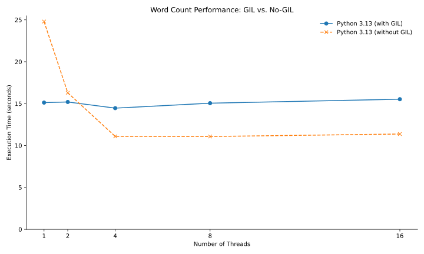
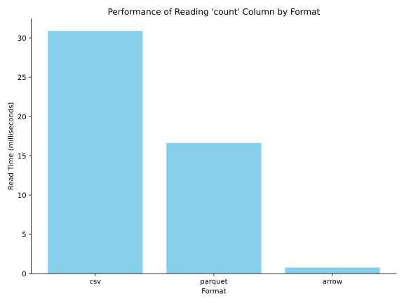

# DRAFT! Don't start yet

# P3 (3% of grade): Concurrent Word Count and Benchmarking/Evaluation

## Overview

In this project, you'll explore the intersection of concurrent
programming, data processing, and AI-assisted code generation. You'll
build a multi-threaded word counting application that processes
compressed text files and outputs structured data in various formats
(Parquet, CSV, or Arrow). You'll then analyze different AI models'
abilities to generate this code, test the generated solutions, and
benchmark performance across different configurations.

Learning objectives:
* Write multi-threaded Python applications with correct lock usage
* Understand the performance implications of the Global Interpreter Lock (GIL) in Python
* Compare and evaluate code generation capabilities across different AI models
* Design test suites to validate AI-generated code
* Benchmark and analyze performance of different data formats (CSV, Parquet, Arrow)

Before starting, please review the [general project directions](../projects.md).

## Corrections/Clarifications

* Fri - Oct 10: Updated guidelines for using external AI. 
* Fri - Oct 10: Added a note for guidelines on generating tests. 

## AI Usage

For this project, you'll use Aider with three different Gemini models to generate code:
* Gemini 2.5 Pro
* Gemini 2.5 Flash
* Gemini 2.5 Flash-Lite

You may use other AI tools to ask questions and learn strictly and code generation, you are restricted to Aider with the above models.  
For prompt generation, organization and project summarization, it is expected that you do it manually.
You must run Aider with `--no-gitignore` and submit the Aider history files (`.aider.chat.history.md` and `.aider.input.history`).  Prompt sharing between students who are not partnerns is not allowed.
As usual, you will answer the questions in `ai.md`.

## Part 1: Concurrent Word Count

You will write a specification for this program, then use different models to generate code from the same spec.

### Specification

Write a specification document (`spec.md`) that describes how an AI
model should implement a multi-threaded word counting program. Your
specification should be detailed enough that a model can generate
(mostly) working code from it in a single shot.

This README.md specifies general requirements, but not details about
how to implement the solution.  So you can copy a bit from the README
when writing your `spec.md`, but you should be more specific in your
document (for example, about what data structures to use, how to
create threads, when to hold locks, what libraries to use, etc).

The program should be invoked as:
```bash
python3 PROGRAM_NAME <input_directory> <output_file> <threads>
```

Where:
* `<input_directory>` contains `.txt.gz` compressed text files
* `<output_file>` is the path for the output file (CSV, Parquet, or Arrow based on extension)
* `<threads>` is the number of worker threads to use

The program will read all `.txt.gz` files from the input directory.
It will count word occurrences, per file and overall.  Ignore case.
Words will be separated by any kind of whitespace (don't worry about
punctuation).

The output table should be as follows:
   - Columns
     - First column: `word` (the word as a string)
     - Second column: `count` (total count across all files)
     - Remaining columns: one column per input file with counts from that file.  The column name should be the filename (the directory containing the file should NOT be part of the column name)
   - Example: if input directory has `file1.gz`, `file2.gz`, `file3.gz`, the output has columns: `word`, `count`, `file1.gz`, `file2.gz`, `file3.gz`
   - Support CSV (`.csv`), Parquet (`.parquet`), and Arrow (`.arrow`) formats based on file extension

Your program should launch the specified number of threads to complete
the work.  Use the thread and lock calls we taught in class.  Make
sure the code is correct (safe access to shared data structures, main
thread wait to produce output until other threads finish, etc).  Make
sure it is efficient (make good decisions about lock granularity,
holding locks during I/O, etc).

A file should be processed by a single thread.  Print messages when a
thread starts or finishes processing a file: "start file1.gz" and
"finish file1.gz", respectively (and similarly for other files).  An
individual file should be processed by only one thread.

### Code Generation

Create an `app` directory in your repo to store all your Python implementations.

For each model (`gemini-2.5-pro`, `gemini-2.5-flash`,
`gemini-2.5-flash-lite`), follow these steps:

1. Start Aider with the model: `aider --model gemini/???? --no-gitignore`

2. Add your spec file and ask Aider to implement it specify where the code should go based on the model used (`pro.py`, `flash.py`, `lite.py`):

   ```
   /add spec.md
   /code Read spec.md, and implement the requirements in a file named app/????
   ...
   ```

3. Exit Aider, and record the cost in Q1 of `ai.md`.

Review the 3 implementations, and copy the one you like best to
`app/final.py`.  Make manual corrections or use additional Aider
prompts to fix any issues.  Answer the remaining questions in `ai.md`.

If you choose to user Aider for any of the remainder of the project, you can use any of the three models you choose.  But be sure you spend <$5 total on this project, to keep enough credit for future projects.

### Docker Deployment

Create a `Dockerfile` in the root of your repo that sets up an environment with Python 3.13 both with and without the GIL. Your Dockerfile should:

1. Start from `ubuntu:24.04`
2. Install Python 3.13 with standard GIL
3. Install Python 3.13 without GIL (nogil version)
4. Copy all implementations from the `app` directory into the image
5. Install packages required by your code

For inspiration, consider these:
* https://git.doit.wisc.edu/cdis/cs/courses/cs544/f25/main/-/blob/main/meena_lec/13-threads/Dockerfile
* https://git.doit.wisc.edu/cdis/cs/courses/cs544/f25/main/-/blob/main/tyler-lec/threads/Dockerfile

Build your image:
```bash
docker build -t p3-wordcount .
```

Create some test files in an `inputs` directory.  Given they must be
compressed, it might be worthwhile to write a quick program with Aider
to generate some inputs for you to test your code with rather than do
this manually.

Run with standard Python (with GIL), 4 threads, to CSV:
```bash
docker run -v ./inputs:/inputs -v ./outputs:/outputs p3-wordcount python3.13 final.py /inputs /outputs/output.csv 4
```

Run with Python nogil (without GIL), 8 threads, to Parquet:
```bash
docker run -v ./inputs:/inputs -v ./outputs:/outputs p3-wordcount python3.13-nogil final.py /inputs /outputs/output.parquet 8
```

The `-v VM_DIR:CONTANIER_DIR` allows your containerized programs to write files to the CONTAINER_DIR, such that you can see them in VM_DIR after a container exits.

## Part 2: Test Suite

Now, you will write some tests in `app/test.py` so you can evaluate
your implementations.  Use the pytest framework.  Aider will probably
be useful in generating some of these.

Use an environment variable for the program name so we can run your
tests with different implementations, like this:

```
docker run -e PROGRAM=<PROGRAM_NAME> p3-wordcount python3.13 -m pytest /app/test.py
```

For example, we might test `pro.py` like this:

```
docker run -e PROGRAM=pro.py p3-wordcount python3.13 -m pytest /app/test.py
```

We will only test on python3.13, for this part, so your tests can assume this when launching a program:

```
subprocess.run(["python3.13", PROGRAM_NAME, ...], ...)
```

Requirements:
1. You should have at least 6 tests, on whatever you think is important.  You can optionally read about how to parameterize tests.  Each run of a parameterized test counts toward the 6.  For example, if a single parameterized test runs with Arrow, Parquet, and CSV, that would count as 3 tests.
2. `final.py` should pass all of your tests.
3. Each of the other implementations should pass at least 1 test (if not, either write a test that evaluates something simpler, or go back and create a better prompt to create these).
4. At least one of the the other implementations (`lite.py`, `flash.py`, or `pro.py`) should fail at least one test.

Read the AI generated code and see if you can identify at least one
bug to satisfy the fourth requirement.  If you don't see any bugs,
modify the `lite.py` code to introduce a bug (as a way to test your
tester!).  Leave a comment `# BUG!` by the code you modified for this
purpose.

Note: You are expected to write and run your own tests. 
Tests generated by Autobadger do not count toward the required 6 tests, but tests written with the help of Aider or manual generation are acceptable. 
Review your code carefully and design tests that cover a range of input scenarios, including edge cases.

## Part 3: Thread Benchmarking

You will now do an experiment to compare the impact of thread count on
the performance of your `final.py` program, for both Python runtimes
(gil and nogil).  You will present your results like this:



Note that your numbers will vary, but if they are dramatically
different, it is a sign that you may have a bug.

Your benchmarking program will be in `app/thread_bench.py` will work like this:

```bash
python3.13 thread_bench.py <output_directory>
```

Normally, though, it will be executed in a Docker container (so make sure it gets copied to your image):

```
docker run -v ./outputs:/outputs p3-wordcount python3.13 thread_bench.py /outputs
```

After execution, the `outputs` directory will contain a plot like above, `thread.svg`, and a `threads.csv` file with corresponding data, with columns like this:

 - `threads`: number of threads used
 - `gil_seconds`: execution time with standard Python (GIL)
 - `nogil_seconds`: execution time with Python nogil (no GIL)

Note that thread_bench.py does not specify what program to run: you
can hardcode `final.py`.

Also note that thread_bench.py does not specify any inputs.  Your benchmark should generate them as follows:

 - Generate exactly **256 `txt.gz` files**
 - Use a vocabulary of **1,000 randomly generated words**
 - Each file should contain **1 million occurences** of those words

## Part 4: Format Benchmarking

You will now do an experiment to compare the read performance on tables in the different formats your word counter is capable of writing.  You will present your results like this:



Your benchmarking program will be in `app/format_bench.py` will work like this:

```bash
python3.13 format_bench.py <output_directory>
```

Normally, though, it will be executed in a Docker container (so make sure it gets copied to your image):

```
docker run -v ./outputs:/outputs p3-wordcount python3.13 format_bench.py /outputs
```

After execution, the `outputs` directory will contain a plot like above, `formats.svg`, and a `formats.csv` file with corresponding data, with columns like this:

 - `format`: the format name (csv, parquet, arrow)
 - `read_seconds`: time to read the count column and compute its sum

Your format_bench.py should generate a random input dataset the same way thread_bench.py does.  Then, run `final.py` three times on the same inputs to produce outputs in the three formats.

Finally, format_bench.py should time how long it takes to read the data in each format and compute a sum over the `count` column.

Requirements:
 - **Parquet**: Use selective column reading to access ONLY the `count` column
 - **Arrow**: Use memory mapping (`mmap`) to access the file

## Submission

In your repository, you should have the following files:
- `spec.md`, `ai.md`
- `.aider.chat.history.md` and `.aider.input.history`
- `app/final.py`, `app/pro.py`, `app/flash.py`, `app/lite.py`
- `Dockerfile`
- `app/test.py`, `app/thread_bench.py`, `app/format_bench.py`
- `outputs/threads.csv`, `outputs/threads.svg`, `outputs/formats.csv`, `outputs/formats.svg`

## Tester

Use the **autobadger** (`1.0.8`) on your machine to run tests against your code:

```bash
autobadger --project p3 --verbose
```

The `--verbose` flag will print more information to the console as your tests are running.

Pushing to `main` will submit your project and we will grade your code
on `main` from a remote VM. A GitLab issue should be pushed to your
repository shortly after you submit.
