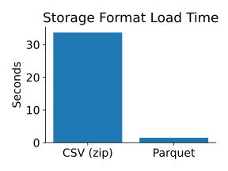
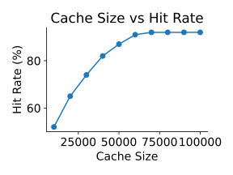
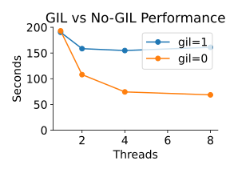

# P3 (3% of grade): Performance Study

## Overview

In this project, you will build a small, multi-threaded application
that uses caching (to avoid network I/O) and loads data from different
formats.

Most of this project will focus on writing small benchmarks to
evaluate the performance of your application under different
configurations.  For example, you will compare the load time for
different formats, measure the hitrate as a function of cache size,
and find the best combination of thread parallelism and GIL usage.

For part 1, you will implement your application.  For the other parts,
you will also be producing code, but your main artifact will be a
PDF-based report.

* open this template: https://docs.google.com/document/d/1wpv5mNjvMH14iWGSdibsriqMUPTMfd3smyDzNlQBqLM/edit?usp=sharing
* copy to a private location on your Google drive
* for parts 2-4, fill in the relevant sections
* export to a PDF, named perf.pdf
* push perf.pdf to repo (top level, not a sub directory)

## Learning Objectives

- Implement thread-safe shared data structures (`FIFO`) with correct lock usage
- Build a multi-threaded client that interacts with a remote data service
- Understand GIL vs No-GIL performance behavior under different thread counts
- Design tests that validate correctness and edge-case handling
- Benchmark and analyze format performance (`CSV` and `Parquet`)

Before starting, review general project directions from class.

## Corrections/Clarifications

- none yet

## AI Usage

You must write `cache.py` by hand, without AI.  For the rest, you may use Aider with gemini-2.5-pro for anything you like.  You must use it for at least one thing of your choice.  You may not use other AI for code generation (only for asking general questions; for example, to learn about Python data structures you might use).

## Setup

Copy starter files from the `p3` directory in the main repo to your project repo:

```
cp -r app_cli app_server Dockerfile.server Dockerfile.client \
  docker-compose.yml port.sh <PROJECT REPO>
cd <PROJECT REPO>
git add app_cli app_server Dockerfile.server Dockerfile.client docker-compose.yml port.sh
git commit -m 'starter code'
```

Download the HMDA Wisconsin 2021 data into a `data` directory (this will be mounted into the client container):

```bash
mkdir -p data
wget https://pages.cs.wisc.edu/~harter/cs544/data/2021_public_lar_csv.zip -O data/2021_public_lar_csv.zip
wget https://pages.cs.wisc.edu/~harter/cs544/data/2021_public_lar.parquet -O data/2021_public_lar.parquet
```

Do NOT "git add" or "git commit" these large files in your repo.

Build and start:

```bash
export PROJECT=p3
docker compose up --build -d -t 0
```

Verify the server is working from your VM.  We provide a small script (`port.sh`) for looking up the external port number for one of your containers, because it may change each time.  You can use backticks to run the script to get the port number, then immediately use it in a curl command:

```bash
curl localhost:`./port.sh p3-server-1`/01001020200
```

You should get back a number (the median household income in thousands for that census tract).

## Part 1: Income Analysis

The HMDA data contains US-wide loan applications for 2021.  Loan
applications are associated with census tracts.  The American
Community Survey (ACS) provides data about median income per census
tract.

You will write a program to study housing affordability, and answer this question:

**For each state, what percent of loan applicants have below-median income for the corresponding census tract area?**

You will write a client program that loops over the HMDA data
directly.  But instead of accessing ACS data directly, the client will
send requests to a server to lookup median income.  

The server exposes tract-income lookup as REST:

- Method: `GET`
- Path: `/<tract_geoid>`
- Success response (`200`): plain-text numeric tract median income (in thousands)
- Missing tract (`404`): no body

The client will need to lookup certain values repeatedly, so we will
cache these.  Given the server implements a REST API, you will
implement a generic HTTP cache, keyed by URL (values will be the HTTP
responses).

### HTTP Cache (cache.py)

Look at `http_get` in cache.py.  The call takes a URL and an
`http_session` (a `requests.Session` object) and implements retry, but
no caching (yet).  The caller is responsible for creating the session.
`requests.Session` is not thread safe, so each thread should create
its own.  Using a session (rather than bare `requests.get`) enables
HTTP connection reuse, which is much faster.

The cache.py code can work as a program or a module. For `python3
cache.py args...`, the `__main__` code will run.  For `import cache`,
the main won't run, but the importer can use `http_get`.

Add thread-safe caching functionality to `http_get`, and return True for cache
hits.  For 404 responses, cache `None` as the content (do not raise an exception).
For other error status codes, raise with `raise_for_status()`.

Requirements:
* one global lock, and use it whenever shared data structures are accessed
* do not hold the lock when doing I/O
* implement a FIFO policy
* choose data structures so that eviction is an O(1) operation.  You'll need to do some reading and investigation to find good built-in data types.  Note that popping index 0 from a list (as in lecture) is an O(N) operation

The `__main__` block in `cache.py` lets you test caching directly.  It initializes a cache of size 3 and fetches each URL given as an argument, printing the total hit count at the end.  Try it with `docker exec` (make sure compose is up first):

```bash
docker exec p3-client-1 python3.13-nogil cache.py \
  http://server:8001/55001950100 \
  http://server:8001/55001950201 \
  http://server:8001/55001950100 \
  http://server:8001/55001950201 \
  http://server:8001/55001950100
```

You should see `hits: 3` (the first two are misses, the last three are cache hits).

Try testing your eviction policy too.  With a cache of size 3, try passing 4 different URLs, then repeating the first -- since the cache is FIFO, the first URL should have been evicted.

### Analyzer (client.py)

Write a client.py program that works like this:

```bash
docker exec p3-client-1 python3.13-nogil client.py /data/2021_public_lar_csv.zip --rows 50000 --cache 2000 --threads 8
```

It should open the data file, supporting zipped CSV and Parquet (infer which to do based on file extension).  Use `pyarrow` (not `pandas`) to read only these three columns into an Arrow table:

- `state_code`
- `census_tract`
- `income`

For Parquet, use `pyarrow.parquet.read_table` with its `columns` parameter (as shown in class).  For CSV, use `pyarrow.csv.read_csv` with a [ConvertOptions](https://arrow.apache.org/docs/python/generated/pyarrow.csv.ConvertOptions.html) to select columns.

**Memory tip:** By default, pyarrow infers the schema (column types) for all columns in the CSV, which requires substantial memory for wide files like this one (99 columns, 26M rows).  Run `docker stats` in another terminal to monitor memory usage.  If your container is getting killed (exit code 137), read about how to explicitly specify column types in `ConvertOptions` to avoid the inference overhead.

After reading, slice the table to the first `rows` entries using Arrow's `.slice(0, rows)`.  If `--rows=-1`, do not slice.  Keep the data as an Arrow table (do not convert to Python lists) -- this is important for memory efficiency given the 26M+ rows.

Import the cache you wrote and initialize to the given size.

Start the specified number of threads to perform the analysis.  Each should be passed a start and stop index.  Each thread will loop over the indicated range of the table.  You can index individual values from an Arrow column like `table.column("col_name")[i].as_py()`.  The ranges should be roughly even in size.  For example, say there are a million rows, but you load like this: `--rows 9 --cache 2000 --threads 3`.  The ranges might be like this (inclusive start, exclusive end):

* thread 0: indexes 0-3
* thread 1: indexes 3-6
* thread 2: indexes 6-9

When a thread loops over the index for a state/tract/income, it should lookup the median income for the tract (with the help of a the cache), and count the loan application as under (income < tract median income) or over (income >= tract median income).  The thread should also count hits.

The client should skip bad rows safely (with `continue`) instead of crashing.  Bad rows include:

- invalid or missing `census_tract`
- invalid, missing, or non-positive `income`
- rows where server lookup returns `404` (the cache will return None)

After the threads exit, you will need to output the hit rate and a percentage per state (what percent of incomes for loan applicants are < the median for their census tract).

For example, imagine 6 rows across 2 states and 3 tracts.  Suppose the server returns median incomes of 60 for tract A, 70 for tract B, and 40 for tract C.

| row | state     | tract       | income | tractmedian |
|-----|-----------|-------------|--------|-------------|
| 0   | WI        | A           | 50     | 60          |
| 1   | WI        | A           | 100    | 60          |
| 2   | IL        | B           | 50     | 70          |
| 3   | IL        | B           | 100    | 70          |
| 4   | IL        | C           | 50     | 40          |
| 5   | IL        | C           | 100    | 40          |

WI has 2 rows, 1 is under: 50%.  IL has 4 rows, 1 is under the associated tract median: 25%.  There are 3 unique tracts but 6 lookups, so with a large enough cache we'd expect 3 hits out of 6 lookups, a 50% hit rate.

The output format will be like this (round down percents with `int(...)`):

```
...other output you may want...
IL: 25% of 4
WI: 50% of 2
hit rate: 50%
```

Make sure you calculate statistics in a thread-safe way.  There are a couple approaches you could consider:
1. adding another lock in client.py, and hold it when a thread updates stats that other threads might update too
2. compute partial stats/counts for each thread, and wait until after all threads return (using `join`) before adding to get totals

## Part 2: Storage Performance

Is Parquet or zipped CSV faster?  Write a benchmark program that uses
[subprocess](https://docs.python.org/3/library/subprocess.html) to run
your client both ways, timing each run (the benchmark program should
do the timing, not the client).

Your benchmark should write the measurements to a CSV file.  Another
program should take this CSV file in, and produce a bar plot in a file
named `storage.svg`.  You can name the other files (the two programs
and CSV file) as you like.

In order to get the CSV and SVG out of your container, you may wish to
run your benchmarking and plotting tools outside of Docker.  In this
case, your benchmark might be using `subprocess` to run a `docker exec
...` command.

To measure storage performance specifically, run with `--rows=0` so
that no rows are processed after the load.

Your measurements may vary, but the plot should look something like this:



## Part 3: Memory Performance

How does cache size impact your hit rate?  Write a benchmark program
that runs your client with cache sizes of 10k, 20k, 30k, ..., 90k, and
100k.  Use 4 threads and 1 million rows of Parquet input for all runs.

Your benchmark should write the measurements to a CSV file.  Another
program should take this CSV file in, and produce a line plot in a
file named `memory.svg`.  The x-axis should be cache size and the
y-axis should be hit rate.

Your measurements may vary, but the plot should look something like this:



## Part 4: Compute Performance

How is performance impacted by the GIL and the number of threads?

The `python3.13-nogil` runtime installed in our containers is an
experimental free-threaded build of CPython 3.13.  Unlike regular
CPython, this build lets you control whether the GIL is active at
launch time.  Use only these two modes in your experiments:

1. `python3.13-nogil -X gil=1` — GIL enabled (threads take turns, similar to regular Python)
2. `python3.13-nogil -X gil=0` — GIL disabled (threads can truly run in parallel)

Write a benchmark program that runs your client with thread counts of
1, 2, 4, and 8.  For each thread count, run once in each mode.
Use 1 million rows of Parquet input and a cache size of 50000 for all runs.

Your benchmark should write the measurements to a CSV file.  Another
program should take this CSV file in, and produce a line plot in a
file named `compute.svg`.  The x-axis should be thread count and the
y-axis should be seconds.  Plot one line for each GIL mode.

Your measurements may vary, but the plot should look something like this:



## Submission

Read the directions [here](../projects.md) about how to create the
repo.

Remember to submit your perf.pdf, since we will review that manually,
and it will be worth 60% of your grade!

Please add `.aider.input.history` and `.aider.chat.history.md` to your
repo.  You must be able to clone your repo to a fresh directory, and
bring it up like this:

```
export PROJECT=p3
docker compose up --build -d -t 0
```

We will copy in `docker-compose.yml` and `app_server/`, overwriting
anything you might have changed.  We will then run your client like
this:

```bash
docker exec p3-client-1 python3.13-nogil client.py /data/2021_public_lar.parquet --rows 50000 --cache 2000 --threads 8
```

Your submission repo should contain at least the following:

* `app_cli/cache.py` — thread-safe FIFO HTTP cache (these get copied into the container at build time)
* `app_cli/client.py` — multi-threaded analysis client
* `app_server/server.py` — server code (unchanged from starter)
* `Dockerfile.server`, `Dockerfile.client` — container build files
* `docker-compose.yml` — compose config (unchanged from starter)
* `port.sh` — port lookup helper (unchanged from starter)
* `storage.svg` — bar plot from Part 2
* `memory.svg` — line plot from Part 3
* `compute.svg` — line plot from Part 4
* `perf.pdf` — filled-in report template
* `.aider.input.history`, `.aider.chat.history.md` — AI usage logs
* benchmark/plotting programs for Parts 2–4 (you may name these as you like)

**Optional:** consider providing feedback on the project to earn extra credit: https://tyler.caraza-harter.com/cs544/s26/forms.html.

## Tester

Details coming soon.  Part 1 will be mostly autograded.  Parts 2-4 will be human reviewed.
