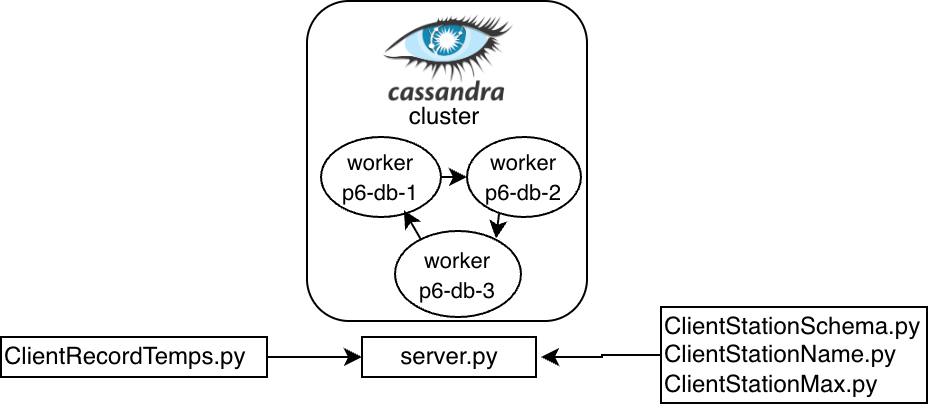

# DRAFT! Don't start yet

# P6 (3% of grade): Cassandra, Weather Data

## Overview

NOAA (National Oceanic and Atmospheric Administration) collects
weather data from all over the world.  In this project, you'll build
a gRPC server that receives data (from some .py client, but imagine
weather stations) and inserts it into a Cassandra table.  Your server
will also let clients ask simple questions about the data.




We'll also explore read/write availability tradeoffs.  We always want
sensors to be able to upload data, but it is OK if we cannot always
read the latest stats (we prefer an error over inconsistent results).

Learning objectives:

* create Cassandra schemas involving partition keys and cluster keys
* use Spark to preprocess data for insertion into Cassandra
* configure queries to achieve a tradeoff between read and write availability
* use prepared statements

**Note**: There is no AI requirements for this project.


Before starting, please review the [general project directions](../projects.md).

## Corrections/Clarifications

* Nov 13: Added a clarification in section 4.3 about how to test the two read profiles defined.
* Nov 17: Released autobadger for p6 (version **1.0.12**)

## Project Setup

**IMPORTANT:** You are given the following files:
* `Dockerfile`
* `docker-compose.yml`
* `cassandra.sh`
* `src/Client*.py`
* `src/station.proto`

You may not modify them, otherwise the autobadger may give 0 points.

Note that the compose file assumes there is a "PROJECT" environment variable.  You can set it to p6 in your environment:
* `export PROJECT=p6`

We provide the Dockerfile and docker-compose.yml for this project. In
the Dockerfile, we install several necessary Python packages.
You can also add more packages you need in src/requirements.txt. You can
run the following:

* `docker build . -t p6`
* `docker compose up -d`

It will start three containers ('p6-db-1', 'p6-db-2', 'p6-db-3'). It generally takes around 1 to 2 minutes for the Cassandra cluster to be ready.  **Note that** you may not modify the Dockerfile.


Run the following command:

```
docker exec p6-db-1 nodetool status
```

If the cluster is ready, it will produce an output like this:

```sh
Datacenter: datacenter1
=======================
Status=Up/Down
|/ State=Normal/Leaving/Joining/Moving
--  Address     Load       Tokens  Owns (effective)  Host ID                               Rack 
UN  172.27.0.4  70.28 KiB  16      64.1%             90d9e6d3-6632-4721-a78b-75d65c673db1  rack1
UN  172.27.0.3  70.26 KiB  16      65.9%             635d1361-5675-4399-89fa-f5624df4a960  rack1
UN  172.27.0.2  70.28 KiB  16      70.0%             8936a80e-c6b2-42ef-b54d-4160ff08857d  rack1
```

If the cluster is not ready it will show an error (usually a Java
IllegalArgumentException exception). If this occurs then wait a little
bit and rerun the command and keep doing so until you see that the
cluster is ready.

## Part 1: Server Initialization

For this part we provide the following client programs and [src/station.proto](src/station.proto).

* Inside the [src/](src/) directory you will find 4 client programs:
  - `ClientStationSchema.py`
  - `ClientStationName.py`
  - `ClientRecordTemps.py`
  - `ClientStationMax.py`

  They will communicate with your `server.py`, via gRPC. We'll explain each RPC in detail later.
*  station.proto contains `rpc` and `message` entries to generate a gRPC stub (used by our clients).

Run the grpc_tools.protoc tool in p6-db-1 to generate stub code for our clients and servicer code for your server.

```sh
docker exec -w /src p6-db-1 sh -c "python3 -m grpc_tools.protoc -I=. --python_out=. --grpc_python_out=. station.proto"
```

**Your job for this part is to finish writing the `StationService` class in the provided server.py (`StationService` overrides methods in the `StationServicer` class generated by the protoc tool).**
Specifically, in your server, you need to complete the `__init__` function and override four RPC methods for the StationService class (sections marked as TODO).

**Note:** Don't delete `print("Server started")` in `StationService.__init__` or add any code after it in the constructor.  The autograder will watch for that print to know your server is ready.

### 1.1 Communication

If communication is working correctly so far, you should be able to start a server and use a client to get back a "TODO" error message via gRPC:

```
# In a terminal, to start Cassandra server:
docker exec -it -w /src p6-db-1 python3 -u server.py

# in a second terminal:
docker exec -w /src p6-db-1 python3 ClientStationSchema.py
```

### 1.2 Cassandra Schema definition

Inside the `__init__` method, you firstly need to connect to the Cassandra cluster. **Hint:** Use the Cassandra from python connector as we covered in the demo lecture.

Note: when running locally, the workers will be named `p6-db-<N>`, but
the autograder will use a different prefix, `????-db-<N>`.  You can
use `os.environ['PROJECT']` to get the prefix programmatically and
connect to the correct Cassandra workers.

Write additional python code using the Cassandra cluster connection to run CQL queries that do the following:

* drop a `weather` keyspace if it already exists
* create a `weather` keyspace with 3x replication
* inside `weather`, create a `station_record` type containing two ints: `tmin` and `tmax`
* inside `weather`, create a `stations` table containing four columns: `id` (text), `name` (text), `date` (date), `record` (weather.station_record):
  * `id` is a partition key and corresponds to a station's ID (like 'USC00470273')
  * `date` is a cluster key, ascending
  * `name` is a static field (because there is only one name per ID).  Example: 'UW ARBORETUM - MADISON'
  * `record` is a regular field because there will be many records per station partition.

##### RPC - `StationSchema`:

Now you'll implement StationSchema function in StationService class. It should execute `describe table weather.stations` cassandra query and extract the `create_statement` from result.  

Then, after restarting server.py ('server started' printed in the terminal), you should be able to use ClientStationSchema.py to make a client call:

```
docker exec -w /src p6-db-1 python3 ClientStationSchema.py
```

If your implementation is correct, the above command will print out something like this:

```
CREATE TABLE weather.stations (
    id text,
    date date,
    name text static,
    record station_record,
    PRIMARY KEY (id, date)
) WITH CLUSTERING ORDER BY (date ASC)
    AND additional_write_policy = '99p'
    AND bloom_filter_fp_chance = 0.01
    AND caching = {'keys': 'ALL', 'rows_per_partition': 'NONE'}
    AND cdc = false
    ...
```

### 1.3 Spark Session

Your `StationService` constructor should also create a Spark session like this:

```python
self.spark = SparkSession.builder.appName("p6").getOrCreate()
```

You'll use your Spark session in the next part to process a text file describing stations and insert that into your Cassandra table.

This is a local Spark deployment, so you won't have separate Spark
workers and a boss.  Instead, tasks run in the Spark driver for the
session, so in the same container as your server.py.  This means local
file paths will work, and you won't use HDFS for anything in this
project.

## Part 2: Station Data (Per Partition)

Your constructor should load data with Spark from [src/ghcnd-stations.txt](src/ghcnd-stations.txt), then insert to Cassandra.  **Hint:** check demos in lecture _"Cassandra Query Language (CQL)"_ where we did some similar file parsing.

In your implementation, do the following:

* Use Spark and `SUBSTRING` to extract `ID`, `STATE`, and `NAME` from `src/ghcnd-stations.txt`.  Reference the documentation to determine the offsets (this contains format descriptions for several different files, so be sure you're reading about the correct one): https://www.ncei.noaa.gov/pub/data/ghcn/daily/readme.txt
* Filter your results to the state of Wisconsin, and collect the rows so you can loop over them
* Do an `INSERT` into your `weather.stations` table for each station ID and name. 

##### RPC - `StationName`:

You'll implement the `StationName` function in `StationService`
class. The function should execute a Cassandra query and parse the
result to obtain the name of a station for a specific station id. The
station id is stored in `request.station` (refer to station.proto).

Then, you can use ClientStationName.py to make a client call:

```
docker exec -w /src p6-db-1 python3 ClientStationName.py USW00014837
```

If you did load station data and execute `StationName` correctly, it should print out "MADISON DANE CO RGNL AP".

Additionally, you can verify your `weather.stations` table is being populated by using `cqlsh` commands. For example, you should get something like this:
```
cqlsh> select * from weather.stations where id='USW00014837';

 id          | date | name                    | record
-------------+------+-------------------------+--------
 USW00014837 | null | MADISON DANE CO RGNL AP |   null

(1 rows)
```

## Part 3: Weather Data (Per Row)

#### RPC - `RecordTemps`:

Now you'll implement `RecordTemps` function in `StationService`
class. It receives temperature data and writes it to
`weather.stations`.

The ClientRecordTemps.py pulls its data from src/weather.parquet.  You can run it as follows:

```
docker exec -w /src p6-db-1 python3 ClientRecordTemps.py
```

If you don't return an error, it will print lines formatted as follows: `Inserted {station_id} on {date} with tmin={tmin} and tmax={tmax}`, indicating the insert was sent to your server.  You can use `cqlsh` to confirm your server in turn inserted to Cassandra, you should get 

```
cqlsh> select * from weather.stations where id='USW00014837' limit 10;

 id          | date       | name                    | record
-------------+------------+-------------------------+--------------------------
 USW00014837 | 2022-01-01 | MADISON DANE CO RGNL AP |   {tmin: -99, tmax: -32}
 USW00014837 | 2022-01-02 | MADISON DANE CO RGNL AP |  {tmin: -166, tmax: -82}
 USW00014837 | 2022-01-03 | MADISON DANE CO RGNL AP |  {tmin: -177, tmax: -66}
 USW00014837 | 2022-01-04 | MADISON DANE CO RGNL AP |    {tmin: -88, tmax: -5}
 USW00014837 | 2022-01-05 | MADISON DANE CO RGNL AP |   {tmin: -116, tmax: -5}
 USW00014837 | 2022-01-06 | MADISON DANE CO RGNL AP | {tmin: -188, tmax: -116}
 USW00014837 | 2022-01-07 | MADISON DANE CO RGNL AP | {tmin: -221, tmax: -105}
 USW00014837 | 2022-01-08 | MADISON DANE CO RGNL AP |  {tmin: -127, tmax: -32}
 USW00014837 | 2022-01-09 | MADISON DANE CO RGNL AP |  {tmin: -138, tmax: -21}
 USW00014837 | 2022-01-10 | MADISON DANE CO RGNL AP | {tmin: -199, tmax: -127}

(10 rows)
```

#### RPC - `StationMax`:

Similarly, You'll also implement `StationMax` RPC in server.py, which will return the maximum `tmax` ever seen for the given station.

Then, you can use ClientStationMax.py to make a client call:

```
docker exec -w /src p6-db-1 python3 ClientStationMax.py USR0000WDDG
```

If you did RecordTemps and StationMax correctly, it will print out 344.  That might not look like a real temperature, but the documentation says tmin and tmax are in "tenths of degrees C", so this means the max temp was 34.4 Celcius.

## Part 4: Fault Tolerance

In this part, you’ll make your gRPC server behave sensibly when the Cassandra cluster is partially unavailable.

- **Writes (`RecordTemps`)** should:
  - accept data whenever at least one replica is reachable, and  
  - report a clear `"unavailable"` error when no replica can accept the write.

- **Reads (`StationMax`)** should:
  - prefer a **strong** consistency profile when possible,  
  - automatically fall back to a more **available** profile when the strong one fails, and  
  - report `"unavailable"` if **no** read profile can get a result.

### 4.1 Error Handling in the server

Go back to `RecordTemps` and `StationMax` and add some error
handling code.  If there is a `cassandra.Unavailable` or
`cassandra.cluster.NoHostAvailable` exception, the `error` field in
the gRPC response should be "unavailable" (for the case of `StationMax` this will occur only when you have no fallback left to try).

If there are other exceptions besides these, return an error message
of your choosing.

### 4.2 Consistency Levels (two profiles)

You will configure two consistency level profiles for `StationMax`: one that prioritizes consistency and one that prioritizes availability. You will implement two prepared SELECT max(...) statements for `StationMax`, each with a different consistency level and then use them in order (strong first, then the more available one as a fallback) in `StationMax`.

For both profiles, the server will be highly available for receiving writes:
- Writes (`RecordTemps`):

  Set the write consistency to W = 1 by using `ConsistencyLevel.ONE` for the prepared INSERT statement, since we want the server to almost always accept new temperature readings from sensors, even if some replicas are down. The thought is that real sensors might not have much space to save old data that hasn't been uploaded, so we want to accept writes whenever possible. 

Then, define the two read profiles:

1. Reads (`StationMax`) with Strong profile (prefer consistency)
  
    Choose a read consistency level R such that R + W > RF. In this scenario, we want to avoid a situation where a `StationMax` returns a smaller temperature than one previously added with `RecordTemps`; if replicas disagree or are down we fall back to the available profile (below) instead of failing immediately, and only return an error="unavailable" if both profiles fail.

2. Reads (`StationMax`) with Available profile (prefer availability)

    In this scenario, `StationMax` should use a prepared statement with `ConsistencyLevel.ONE`. Reads are more likely to succeed when some replicas are down, but they may see slightly stale data in more complex scenarios.


To implement your W and R settings in these methods, you need to modify your code to use prepared statements instead of doing
queries directly.  If you have a prepared statement `prepared`, you can
set the consistency level like this:

```python
from cassandra.query import ConsistencyLevel
...
prepared.consistency_level = ConsistencyLevel.????
```

You can fill in the missing code with `ConsistencyLevel.ONE`,
`ConsistencyLevel.TWO`, or `ConsistencyLevel.THREE`.

Specifically, you should define prepare statements for your CQL query in `RecordTemps` and `StationMax`. The prepare statements should be defined in the \_\_init\_\_ function of StationService class, so that the prepared statements can be prepared once and used many times.

### 4.3 Disaster Strikes

In this section, you will simulate node failures and see how your chosen consistency levels and error handling behave in practice.

First confirm that your strong read profile works when the cluster is healthy.

- Test reads (StationMax) - strong behavior:

    Call ClientStationMax.py USR0000WDDG Reads should work with no error, like this:
    ```
    344
    ```

**Important:** run a `docker` command to kill the `p6-db-2` container.

Then run the following command

```
docker exec p6-db-1 nodetool status
```

Verify that you see that one of the nodes is down before proceeding to the next steps.

- Test writes (`RecordTemps`):

    Call ClientRecordTemps.py again. Inserts should happen with `ConsistencyLevel.ONE`, so this ought to work, meaning the empty string is the expected result for `error`.

- Test reads (`StationMax`) - fallback behavior:
    
    Call ClientStationMax.py again. Reads should print the maximum temperature as before, and the indication that the fallback profile was used (use error=`fallback_to_available` in your StationMaxReply), lke this:
    ```
    344 (fallback_to_available)
    ```

## Submission

Read the directions [here](https://git.doit.wisc.edu/cdis/cs/courses/cs544/f25/main/-/blob/main/projects.md?ref_type=heads#project-repository) about how to create the
repo.  Note that we will copy in the the provided files (every file
except `server.py` and `src/requirements.txt`), overwriting anything
you might have changed.

Make sure you upload every file you need to run the following commands:


```
# To build the image
docker build . -t p6

# To start service
export PROJECT=p6
docker compose up -d

# To check cassandra cluster is ready
docker exec p6-db-1 nodetool status

# To build proto file
docker exec -w /src p6-db-1 sh -c "python3 -m grpc_tools.protoc -I=. --python_out=. --grpc_python_out=. station.proto"

# In a terminal, to start Cassandra server:
docker exec -it -w /src p6-db-1 python3 server.py

# in a second terminal, to launch clients:
docker exec -w /src p6-db-1 python3 ClientStationSchema.py
docker exec -w /src p6-db-1 python3 ClientStationName.py USW00014837
docker exec -w /src p6-db-1 python3 ClientRecordTemps.py
docker exec -w /src p6-db-1 python3 ClientStationMax.py USR0000WDDG
```

## Testing:

Please be sure that your installed autobadger is on version **1.0.12**. You can print the version using:
```bash
autobadger --info
```

Run p6 autobadger using:
```bash
autobadger --project=p6 --verbose
```

See [projects.md](https://git.doit.wisc.edu/cdis/cs/courses/cs544/f25/main/-/blob/main/projects.md#testing) for more information.