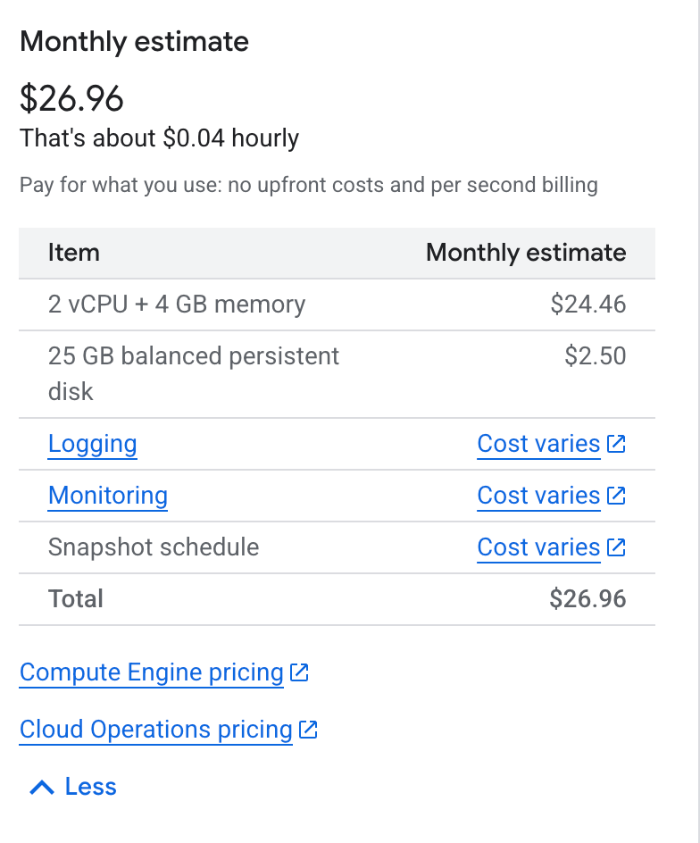
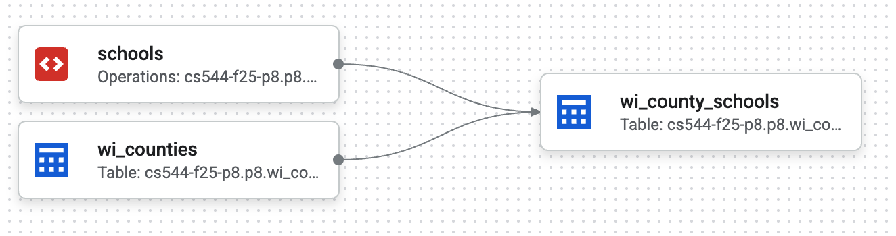

# DRAFT! Don't start yet

# P8 (3% of grade): Google Cloud Services

## Overview

In this project, you'll be using four Google cloud services to analyze
a dataset describing all the schools in Wisconsin.  You'll write your
code in Jupyter, which will run on a GCP VM, and you'll upload your
data to a GCS bucket.  You'll use Dataform to create a pipeline that
brings this data (in combination with public geographic data) into a
BigQuery dataset. Finally, you'll use BigQuery to answer questions
about data.

Learning objectives:

- create a **GCP VM** on a public cloud and connect to it via SSH
- create a **GCS bucket** and upload data to it
- write a **DataForm** pipeline to bring data from GCS to BigQuery storage
- write **BigQuery** queries to manipulate geographic data

Before starting, please review the [general project directions](../projects.md).

> **Important:** This project involves quite a bit of cloud setup (GCP VM, GCS bucket, Dataform, BigQuery, auth, etc.).  
> Please **start early**, so you have time to sort out any account, permission, or credit issues.

## Clarifications/Correction

- 2025-12-04: Updated VM config from Standard persistent disk to Balanced persistent disk for consistancy. It's okay if you set your VM either way. 
- 2025-12-05: Test released.
- 2025-12-08: Added clarification for Q8 and Q10: must use `.query()` method (not `%%bigquery` magic).
- 2025-12-09: Test updated to lift the bigquery magic constraint.

## AI Usage

For this project, you may use any AI tools or models you like for code generation, as long as you document your usage (for example, Aider, Gemini, CoPilot, etc.) in `ai.md`.

## Part 1: Virtual Machine Setup

### Educational Credits 
All CS 544 students were previously provided $50 in GCP educational credits earlier in the semester.
You should have already claimed these credits for earlier projects, if you were able to use Aider before, you are all set and do not need to claim anything again.

If for any reason you did not successfully claim the credits before, or you are unsure whether it worked, please review the following Canvas announcements for instructions: [Section 1](https://canvas.wisc.edu/courses/478879/discussion_topics/2237793), [Section 2](https://canvas.wisc.edu/courses/478879/discussion_topics/2237941)

### Launch VM
You will create a VM in GCP. Since many of you have done this in CS 320/400, these instructions are brief, but please follow the required configuration below.
#### Required VM Configuration

| Setting | Config Value |
|--------|------|
| Machine type | e2-medium (2 vCPU, 1 core, 4 GB memory) |
| Operating System | Ubuntu 24.04 LTS, x86/64 (**not** Arm64) |
| Boot Disk | Balanced persistent disk, 25 GB |
| Region | us-central1 (Iowa) |


#### Steps to Launch

1. Go to [GCP VM](https://console.cloud.google.com/compute/instances)
*(Compute Engine → VM instances)*
2. Create a new VM with the configuration listed above. For other settings such as firewall, you can keep the default value. If everything is set correctly, your estimated monthly cost should look like this:



3. Add your public SSH key [here](https://console.cloud.google.com/compute/metadata?tab=sshkeys) *(Compute Engine > Metadata > SSH Keys)* so you can connect GCP VM from your laptop.
    - More about SSH keys [here](ssh-keys.md).

4. (Optional) If you're worried about exhausting the free tier and your educational
credits, you might also want to setup a quota [here](https://console.cloud.google.com/iam-admin/quotas).

5. Confirm the GCP VM is running and you can connect to it.

### GitLab
SSH authentication to GitLab is only enabled from machines on the same network (like your CSL VM).  That means you cannot use SSH keys to clone/pull/push your repo while working on your GCP VM. Instead, you will use HTTPS with a password. 

#### Step 1: Set a GitLab Password
Set a strong password [here](https://git.doit.wisc.edu/-/user_settings/password/edit) *(Click your avatar in the top-left sidebar in GitLab, go to Preferences → Password)*. You'll use this password whenever pulling or pushing through the HTTPS URL.
#### Step 2: Clone Using the HTTPS URL
When cloning your repository to the VM, make sure you select the HTTPS address (not SSH).

Fallback: If you're running into trouble, a short-term solution is to have your repo on a different machine (your laptop, or CSL VM) and then `scp` files around as necessary.

### GCP Authentication
You'll also need to give your GCP VM permission to access BigQuery. You can do so by pasting the following into the
terminal on your VM and following the directions. **Please read the following cautions before running this command.**
```
gcloud auth application-default login --scopes=openid,https://www.googleapis.com/auth/cloud-platform
```

#### Caution

1. While running the command, it will ask you to paste some link to your browser. If you have multiple Google accounts in your browser, and do not want this to select the default one, then do the following:
   - paste the link in an **incognito mode**
   - login to the Google account of your choice
2. Be careful, because if a malicious party were to gain access to your
   VM, they would have free access to all your cloud services. For example, if your Jupyter is listening publicly (i.e.,
   0.0.0.0 instead of localhost) and you have a weak password (or no
   password), someone could gain access to your VM, and then these other
   resources.
3. You may need to run this command again if you run into an error like "Reauthentication is needed".
4. If you encounter an authentication error when running the gcloud auth command, wait a bit and try again. 

When you're not actively working, you may want to revoke (take away)
the permissions your VM has to minimize risk:

```bash
gcloud auth application-default revoke
```

### Jupyter Setup
Setup a Python `venv` for this project and install some packages:

```shell
sudo apt install python3-venv
python3 -m venv venv
source venv/bin/activate
pip3 install jupyterlab google-cloud-bigquery google-cloud-bigquery-storage bigquery-magics pyarrow tqdm ipywidgets pandas matplotlib db-dtypes pandas-gbq google-cloud-dataform google-cloud-storage
```

With your `venv` still active, run:

```bash
python3 -m jupyterlab --no-browser
```
Hint: Carefully read startup log, you can find port number and token there.
1. Setup an SSH tunnel and connect (as done in previous projects)
2. You'll be prompted to copy/paste a token from the terminal to the browser.
3. Finally, create a notebook named `p8.ipynb` inside of `src/` in your project repo.

Create a `p8.ipynb` notebook inside of `src/`. You'll answer 10 questions in the notebook.


### VM Questions
The following questions will help you check that you created your GCP VM correctly.

#### Q1: What is the OS release?

Write some Python code in a cell starting with `#q1` that reads `/etc/os-release` to a string that is used for the cell output (last line of the cell -- don't use print).

#### Q2: What CPUs does your VM have?

Use the `subprocess` module that comes with Python to programmatically run the `lscpu` program and capture the output in a string that you'll use for the output.

## Part 2: GCS Bucket
Navigate to [Google Cloud Storage WebUI](https://console.cloud.google.com/storage/).  Manually create a private GCS bucket. Bucket names must be globally unique, so you'll need to think of a name that nobody else in the world has already used. For location, choose Multi-region: `us (multiple regions in the United States)`.

Use [pyarrow](https://arrow.apache.org/docs/python/generated/pyarrow.fs.GcsFileSystem.html) in your Jupyter notebook to connect to your bucket.  Read the bytes from the local `wi-schools-raw.parquet` file and use pyarrow to write it to a new GCS file in your bucket.

### Handling Bucket Names in a Team

Since bucket names are globally unique, if you are working in pairs, each partner has their own GCP project and bucket.  
This means you **cannot** hard-code the same bucket name and expect the same code to work for both partners.
The strategies below can also apply to other variables, not just the bucket.
Below are two recommended solutions  *(not graded, but good practice)*:
#### Option A — Environment Variable for Bucket Name
At the top of your `p8.ipynb`:

```python
import os
P8_BUCKET = os.environ["P8_BUCKET"]
```
Use P8_BUCKET everywhere in your code.

Each partner configures their own environment variable once:
```bash
export P8_BUCKET=your-bucket-name
```
Same pattern as earlier projects where we set: export PROJECT=p7

#### Option B — Config File
Create a file named p8_config.json (do not push this to gitlab):
```JSON
{
  "bucket": "your-bucket-name"
}
```
Load it at the top of your notebook:
```python
import json
with open("p8_config.json") as f:
    config = json.load(f)

P8_BUCKET = config["bucket"]
```
Both approaches avoid bucket naming conflicts and improve notebook portability.

---

#### Q3: What are the paths of all the files/directories in the top-level of your bucket?

Return your answer as a list.

#### Q4: What is the modification time of wi-schools-raw.parquet, in nanoseconds?
Return your answer as an int.

## Part 3: Dataform
You'll use Dataform to create a pipeline that brings data from your GCS bucket into a BigQuery dataset.  Create a private BigQuery dataset named `p8` within your project.  You can decide to do this manually via the cloud console or programatically using a BigQuery client in your notebook.  The dataset should have `US(multiple regions in United States)` as the data location.

### Dataform Setup
Now, let's create a Dataform workspace:

1. Navigate to [BigQuery](https://console.cloud.google.com/bigquery)
2. Click `Dataform` in the menu on the left
3. Click `Create Repository`
4. Choose any Repository ID you like, and select "us-central1" for the Region.
5. Click `Grant all` after creation for any missing roles, so that Dataform can run BigQuery queries
6. Navigate to the newly created repo. Click `Create Development Workspace`. Give it an ID and navigate to it.
7. Click `Initialize Workspace`
8. Navigate to the Workspace and edit the `workflow_settings.yaml` file. 
    - defaultLocation should be "US"
    - defaultDataset should be "p8".

Your Dataform code will be run by a default service account; you can think of a service account as basically being a non-human user with some permissions. Your service account will need some additional permissions:

1. Go to [IAM](https://console.cloud.google.com/iam-admin/iam) to update permissions
2. Click "Include Google-provided role grants"
3. Click the edit icon by the "Dataform Service Account"
4. It may already have some roles, but add roles as necessary to make sure it has these four: 
    - BigQuery Admin
    - BigQuery Job User
    - Dataform Service Agent
    - Storage Object Viewer

### Pipeline Code
Now, create 3 `.sqlx` files on your VM defining Dataform actions:
* **wi_counties.sqlx**: select from `bigquery-public-data.geo_us_boundaries.counties` to materialize a table of counties within Wisconsin (you can hardcode FIPS code of 55 for Wisconsin). Config name to wi_counties.
* **schools.sqlx**: use a `LOAD DATA OVERWRITE...` query to create a table `<YOUR_PROJECT>.p8.schools` from the `wi-schools-raw.parquet` file in your GCS bucket.  The config should specify `type: "operations"` and `hasOutput: true` because the SQL doesn't return results, so Dataform cannot infer these details. Config name to schools.
* **wi_county_schools.sqlx**: this should geographically join schools to counties to produce a table with (a) all the columns of schools, (b) a `location` column which is an `ST_GEOGPOINT` based on coordinates of the school, and (c) a `county_name` column indicating the county in which the school is located.  This should use Dataform references to the other tables (`wi_counties` and `schools`), like `${ref('INPUT_TABLE')}`. Config name to wi_county_schools.


Your notebook should contain code that uses a
`dataform.DataformClient` to call `.write_file(...)` to upload each of these to the workspace that you created manually (make sure they were uploaded to the definitions folder). Your code should also call `create_compilation_result` to compile your sqlx files.  Here is an example of how to make the call:

```python
compilation = dfm.create_compilation_result(dataform.CreateCompilationResultRequest(
    parent="projects/????/locations/us-central1/repositories/????",
    compilation_result=dataform.CompilationResult(
        workspace="projects/????/locations/us-central1/repositories/????/workspaces/????",
    ),
))
assert compilation.compilation_errors == []
```

If all `.sqlx` files compile successfully, you should see them in the Dataform web UI, and the Compiled graph (which you can view for Dataform in the cloud console) should look like this:


Then execute the actions from the Dataform UI, just like we did in class.

#### Q5: What are the dependencies between all the Dataform tables?

Return your answer as a dictionary, where each key is an action, and the value is a list of dependencies for that action.  It should look like the following (possibly with additional entries if you have created other actions for practice):

```
{'schools': [],
 'wi_counties': [],
 'wi_county_schools': ['schools', 'wi_counties'],
 ...
}
```

**Hint:** your previous `create_compilation_result` should have
  returned a response object from which you can extract a compilation
  name: `.name`.  You can use this to lookup details about the
  pipeline in the compilation results:

```python
response = df_client.query_compilation_result_actions(
    request={"name": compilation_result_name}
)
```

You can loop over `response.compilation_result_actions`.  Each `action` will have an `action.target.name` and `action.relation.dependency_targets`.

## Part 4: BigQuery

#### Q6: How many counties are in Wisconsin?

Query your new `wi_counties` table to calculate the answer. Do your query in your notebook, using either Jupyter magic (`%%bigquery`) or pure Python (`bq.query(...)` where `bq` is a `bigquery.Client`).
Return your answer as an int.

#### Q7: How many public schools are there in Wisconsin?

Use your `wi_county_schools` table. Count schools where the type is "Public school".
Return your answer as an int.

#### Q8: Which counties have at least 2 cities that each contain 3 or more public high schools?

Use the `.query()` method for this question - do not use BigQuery magic (`%%bigquery`).
Write your query using the [pipe query syntax](https://docs.cloud.google.com/bigquery/docs/reference/standard-sql/pipe-syntax) we covered in class. If you prefer, you may first write the query in standard SQL and then translate it into pipe syntax, notice how the structure and readability change. But you will only be graded on the pipe-syntax query and the final result.

Return your answer as a list, e.g.:
```
['Brown', 'Dane', 'Milwaukee', 'Waukesha']
```

#### Q9: How many times can you run the query from Q8 before you exhaust the BigQuery free tier (1 TiB of processed data)?

Return your answer as an int, rounding down.

#### Q10: For each public middle school in Dane County, what is the geographically closest public high school in Dane County?

Use the `.query()` method for this question - do not use BigQuery magic (`%%bigquery`).
Given you need to give the High School with the minimum distance, you
may want to use the `MIN_BY` [aggregate](https://cloud.google.com/bigquery/docs/reference/standard-sql/aggregate_functions#min_by) instead of `MIN`.

Return your answer as a dictionary, e.g.:
```
{'Badger Ridge Middle': 'Verona Area High',
 'Badger Rock Middle': 'West High',
 'Belleville Middle': 'Belleville High',
 'Black Hawk Middle': 'Shabazz-City High',
 'Central Heights Middle': 'Prairie Phoenix Academy',
 'Cherokee Heights Middle': 'Capital High',
 'De Forest Middle': 'De Forest High',
 'Deerfield Middle': 'Deerfield High',
 'Ezekiel Gillespie Middle School': 'Vel Phillips Memorial High School',
 'Glacial Drumlin School': 'LaFollette High',
 'Glacier Creek Middle': 'Middleton High',
 'Hamilton Middle': 'Capital High',
 'Indian Mound Middle': 'McFarland High',
 'Innovative and Alternative Middle': 'Innovative High',
 'James Wright Middle': 'West High',
 'Kromrey Middle': 'Middleton High',
 'Marshall Middle': 'Marshall High',
 'Mount Horeb Middle': 'Mount Horeb High',
 'Nikolay Middle': 'Koshkonong Trails School',
 "O'Keeffe Middle": 'Innovative High',
 'Oregon Middle': 'Oregon High',
 'Patrick Marsh Middle': 'Prairie Phoenix Academy',
 'Prairie View Middle': 'Sun Prairie West High',
 'River Bluff Middle': 'Stoughton High',
 'Savanna Oaks Middle': 'Capital High',
 'Sennett Middle': 'LaFollette High',
 'Sherman Middle': 'Shabazz-City High',
 'Spring Harbor Middle': 'Capital High',
 'Toki Middle': 'Vel Phillips Memorial High School',
 'Waunakee Middle': 'Waunakee High',
 'Whitehorse Middle': 'Monona Grove High',
 'Wisconsin Heights Middle': 'Wisconsin Heights High'}
```

You are not required to report the actual distances to the nearest
schools, but it may help to know for debugging (the below distances are in kilometers):
```
{'Badger Ridge Middle': 1.8392052150991804,
 'Badger Rock Middle': 5.29072039608733,
 'Belleville Middle': 0.0,
 'Black Hawk Middle': 3.2208653727303473,
 'Central Heights Middle': 0.0,
 'Cherokee Heights Middle': 3.0891335611917463,
 'De Forest Middle': 0.7104369448866054,
 'Deerfield Middle': 0.0,
 'Ezekiel Gillespie Middle School': 0.20996167824816614,
 'Glacial Drumlin School': 8.422858770109299,
 'Glacier Creek Middle': 10.380886949942708,
 'Hamilton Middle': 1.6888876951751441,
 'Indian Mound Middle': 0.3181930065207676,
 'Innovative and Alternative Middle': 0.0,
 'James Wright Middle': 3.099031509318725,
 'Kromrey Middle': 0.633645628693037,
 'Marshall Middle': 0.3692934702053087,
 'Mount Horeb Middle': 0.2247088214705937,
 'Nikolay Middle': 2.7825509153862193,
 "O'Keeffe Middle": 1.1801078611747235,
 'Oregon Middle': 2.199089113737385,
 'Patrick Marsh Middle': 2.995356862757154,
 'Prairie View Middle': 1.4469952774362715,
 'River Bluff Middle': 1.491373618930982,
 'Savanna Oaks Middle': 7.439620069162148,
 'Sennett Middle': 0.1614363991779063,
 'Sherman Middle': 0.0,
 'Spring Harbor Middle': 3.0043175181011414,
 'Toki Middle': 3.9513342414992176,
 'Waunakee Middle': 0.23741587309479018,
 'Whitehorse Middle': 2.252781418278708,
 'Wisconsin Heights Middle': 0.0}
```

## Submission

When you are all done, commit and push to GitLab.

Verify that your submission repository has the following structure with at least these files committed:

```
<your p8 repository>
├── ai.md
└── src
    ├── definitions
    │   ├── wi_counties.sqlx
    │   ├── schools.sqlx
    │   └── wi_county_schools.sqlx
    └── p8.ipynb
```

Do not forget to revoke the permission to access your cloud account:

```
gcloud auth application-default revoke
```

## Testing
Please be sure that your installed autobadger is on version **1.0.15**. You can print the version using:

```bash
autobadger --info
```

Run p8 autobadger using:

```bash
autobadger --project=p8 --verbose
```

The --verbose flag will print more information to the console as your tests are running.
Pushing to main will submit your project and we will grade your code on main from a remote VM. A GitLab issue should be pushed to your repository shortly after you submit.

See [projects.md](https://git.doit.wisc.edu/cdis/cs/courses/cs544/s25/main/-/blob/main/projects.md#testing) for more information.

